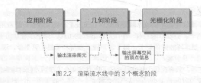

# 2.1 综述

shader只是渲染流水线中的一个环节。

## 2.1.2 什么是渲染流水线

《Real-Time Rendering, Third Edition》中将一个渲染流程分成3个阶段：

- 应用阶段（Application Stage）
  - 由CPU负责实现，开发者具有绝对控制权。
  - 开发者有3个主要任务：
    1. 准备好场景数据，例如摄像机的位置、视锥体、模型、光源等；
    2. 为了提高渲染性能，需要做一个粗粒度剔除（culling）工作，把不可见物体剔除；
    3. 设置每个模型的渲染状态，最重要的是输出渲染所需的几何信息，即**渲染图元（rendering primitives）**。
- 几何阶段（Geometry Stage）
    - 用于处理所有和要绘制的几何相关的工作。例如，需要绘制的图元是什么，怎样绘制等。通常在GPU上进行。
    - 进行逐顶点、逐多边形的操作，可以进一步分成更小的流水线阶段。
    - 重要任务是把顶点坐标变换到屏幕空间中，再交给光栅器进行处理。
- 光栅化阶段（Rasterizer Stage）
    - 在GPU上使用传入的数据来产生屏幕上的像素，并渲染出最终的图像。
    - 主要任务是决定每个渲染图元中的哪些像素应该被绘制。对传入的逐顶点数据进行插值，然后再逐像素处理。

# 2.2 CPU和GPU之间的通信

